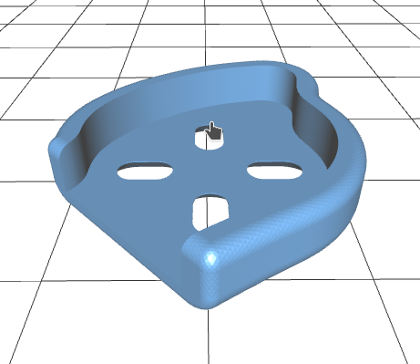
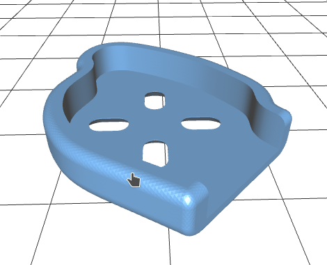

Arm Guard for iFlight iH3 V1
======

- Design has been tested with PETG, ABS, and PLA. 
- PETG and ABS are suggested. PLA does the job but breaks easily so bring spares. 
- TPU will probably work fine.

The front and back arms have different profiles. Use your slicers mirror function to
print the right hand side guards.

